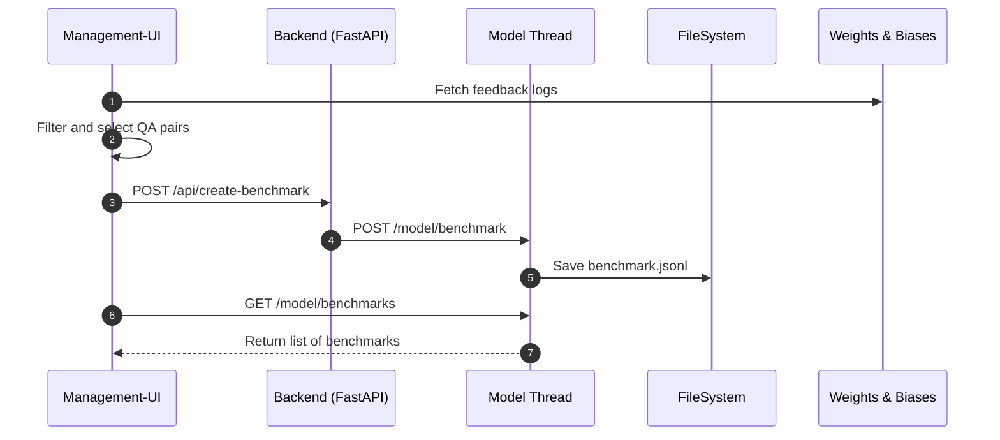

# TAIHU Monitoring System Design: Process-Level Model-View-Controller (MVC)

## Overview

This document outlines the architectural design of the TAIHU Monitoring and App Management Platform using a principled, process-level interpretation of the **Model-View-Controller (MVC)** pattern.

The system manages the lifecycle of search apps—from creation, configuration, and activation to evaluation and monitoring—by separating concerns into well-defined roles:

* **Model**: Owns all state (both static and dynamic)
* **View**: Reads system state and presents it to the user
* **Controller**: Handles all mutations of system state by issuing commands to the model

---

## Motivation

As TAIHU grows to support multiple configurable hybrid search apps with distinct embedders, rerankers, chunkers, and feedback loops, centralized control and traceable state management becomes essential.

To avoid divergence, unclear responsibilities, or inconsistent state access, we adopt a strict MVC architectural pattern across process boundaries—not just inside components.

---

## MVC Mapping

| Role           | Component                        | Responsibilities                                                              |
| -------------- | -------------------------------- | ----------------------------------------------------------------------------- |
| **Model**      | `AppModelThread` (model process) | Owns and synchronizes both static (file-backed) and dynamic (in-memory) state |
| **View**       | `management-ui` (React frontend) | Reads state from the model and presents it to users; cannot mutate            |
| **Controller** | Backend API (FastAPI)            | Accepts mutations from the view and issues them to the model                  |

---

## Design Principles

### 1. Centralized State via the Model

The model thread/process is the **single source of truth** for both:

* **Static state**: JSON configuration files for each app (e.g., `apps_metadata/my_app.json`)
* **Dynamic state**: In-memory `SearchApp` instances that respond to live search and evaluation requests

Only the model thread is allowed to:

* Read and write app config files
* Create or destroy in-memory apps
* Serve app metadata and runtime information

The model may choose to load/unload dynamic objects based on activity, memory constraints, or demand. The total system state is the **union of what’s active in memory and what’s saved on disk**.

### Execution Initialization

The backend (FastAPI controller) and model live in the same Python process for tight coordination and reduced overhead. When the FastAPI app is initialized:

* The model thread is also initialized
* App metadata is loaded from disk
* Apps are **not activated** immediately (similar to `docker images`)
* Activated apps are instantiated on demand, and their state lives in memory

This design enables:

* Fast startup with lazy activation
* Accurate display of available (inactive) apps
* Low memory usage when no app is running

---

### 2. View Reads Through the Model (Not Files)

Although the frontend could technically read configuration files directly from the filesystem, we **disallow this for consistency**.

> ✅ All view-layer reads must go through the model thread, even for static data.

This ensures:

* Consistency between what’s displayed and what’s running
* No duplication of config parsing or rendering logic
* Ability to later virtualize, version, or cache state in the model

---

### 3. Controller as a Mutation Gate

The controller is implemented as a FastAPI-based backend. It:

* Accepts `POST`, `PUT`, and `DELETE` requests from the frontend
* Validates and parses input (e.g. using Pydantic schemas)
* Issues mutation commands to the model process

It cannot:

* Read or write state directly
* Bypass the model to apply changes

The controller also includes **middleware**, such as:

* CORS (Cross-Origin Resource Sharing)
* Logging, authentication (future)
* Request tracking

---

## Weave Integration

Weave is treated as a **remote extension of the model**, responsible for:

* Logging human feedback and interaction traces
* Hosting W\&B dashboards for per-app monitoring
* Managing feedback datasets used for evaluation

### Embedding Strategy:

* Each app integrates W\&B logging directly inside the `src` logic (e.g., `SearchApp`)
* The resulting W\&B run URL is recorded in the `AppConfig` and stored in the model state
* The frontend queries this metadata and renders a direct link to the Weave dashboard

This ensures consistent tracking of each app's lifecycle and reproducibility of evaluations.

---

## Benchmark Curation and Storage

### Design Overview

Benchmark sets are curated by combining:

* User interactions logged to **Weave**
* Explicit app-query-result feedback (positive/negative)
* System manager input (selecting, filtering, saving)

> Benchmarks are also part of the **model state**, consisting of both dynamic and static forms.

### Roles

| Actor          | Responsibility                                                                                        |
| -------------- | ----------------------------------------------------------------------------------------------------- |
| **Model**      | Stores benchmark definitions (JSONL or indexed), loads when needed, applies evaluations               |
| **Controller** | Handles creation/update/delete of benchmarks by passing commands to the model                         |
| **View**       | Fetches Weave interactions, selects query-answer pairs, sends them to backend for benchmark inclusion |

### Workflow

1. **Frontend** pulls candidate feedback from Weave via API
2. User selects which samples to include in a benchmark
3. Frontend sends selected samples to the controller
4. Controller tells the model to:

   * Write samples to disk (`benchmarks/xyz.jsonl`)
   * Register benchmark in internal registry
   * (Optional) Load into memory when evaluation is triggered

Benchmarks can be evaluated lazily—apps may load benchmarks only when needed. The model decides what lives in memory and what remains file-backed.

---

## Model Responsibilities (Updated)

| Function                          | Purpose                             |
| --------------------------------- | ----------------------------------- |
| `load_all_metadata()`             | Load app configs from disk          |
| `instantiate_apps()`              | Use `AppFactory` to build live apps |
| `get_app(name)`                   | Return active `SearchApp`           |
| `get_metadata(name)`              | Return app config                   |
| `create_app(AppConfig)`         | Save app config + activate          |
| `remove_app(name)`                | Teardown app + delete config        |
| `create_benchmark(name, samples)` | Store benchmark samples to disk     |
| `get_benchmark(name)`             | Return benchmark metadata           |
| `evaluate(app, benchmark)`        | Run evaluation and log to Weave     |

---

## Proposed Model Control API

| Endpoint                    | Description                        |
| --------------------------- | ---------------------------------- |
| `GET /model/apps`           | List app metadata                  |
| `GET /model/app/{id}`       | Get single app config              |
| `POST /model/app`           | Create new app                     |
| `POST /model/activate/{id}` | Activate app instance              |
| `DELETE /model/app/{id}`    | Remove app                         |
| `GET /model/benchmarks`     | List known benchmarks              |
| `POST /model/benchmark`     | Create or update benchmark         |
| `POST /model/evaluate`      | Run evaluation of app on benchmark |

---

## System Fault Model

| Failure             | Behavior                                                       |
| ------------------- | -------------------------------------------------------------- |
| **Model down**      | Neither controller nor view can function. No state accessible. |
| **Controller down** | View can read state but not mutate it.                         |
| **View down**       | Controller + model can still run (e.g., via CLI or curl)       |

---

## Sequence Diagram

